# Jittor复现FS-MedSAM2论文

```
本项目提供了基于Jittor框架的FS-MedSAM2论文实现，并与PyTorch版本进行了详细的对齐验证。
我使用的Jittor版本是1.3.10，且基于Linux操作系统
```

数据集选择论文评估所采用的Synapse-CT和CHAOS-MRI，存放于FS_MedSAM2_data中。且数据直接获取论文项目已经处理的数据（来自其所提供的百度云盘），即省略了validation_wopred.py处理原始数据集过程。

由于数据直接使用已处理并压缩为.npz格式的数据，从而导致模型在处理数据过程使用显存极大，为避免cuda显存分配不足，所以直接在配置文件（如：sam2_hiera_t.yaml）中修改图像输入尺寸，由1024->512对于CHAOS-MRI，而Synapse-CT因为其数据量大，所以为1024->256（主要是一开始忘记处理并调整输入数据尺寸而是直接获取论文作者已处理的.npz数据，等cuda显存炸了后只能修改其配置文件使sam2自动调整，所以最终测试结果较论文有出入。gpu显存80G还是不够，有些小bk。不过，我还做了在原pytorch框架下同等条件的测试进行比较，且pytorch使用显存明显小于jittor的使用，则pytorch支持原始尺寸，所以也给了一部分原图像尺寸的测试结果，具体的结果后面会给出。）。此外，在jittor框架下我还在论文作者所给的example_data数据集中选择了9个.npz样本数据基于原图像尺寸（9个刚好不会gpu显存不足）进行了测试。

同时，此论文本质上是给出了一个无需微调的小样本图像分割模型，故本次复现也按照论文的方法一样直接使用sam2所提供的checkpoint节点文件进行配置并直接测试评估而无需训练，因此没有训练脚本和对应的训练实验log。

此外，尽管我在复现过程中，修改了cuda扩展（即post-processing后处理）转换为jittor框架下的扩展，但由于其本身在pytorch框架下测试就无法正常运行（可能是cuda版本的问题），所以后续的均是跳过后处理的推理测试。

## 项目结构

```
JtToFSMedSAM2/
├── FS_MedSAM2/                                       # 原始项目目录   提供example_data和FS-MedSAM2对于sam2的相关修改的关键源码和数据预处理代码validation_wopred.py
├── FS_MedSAM2_data/                                  # 数据目录       包括Synapse-CT和CHAOS-MRI，但仅提供.tar.gz压缩文件，需自己解压
├── SAM2/                                             # sam2模型       包括sam2原始的相关目录（如demo、training等），以及使用jittor实现的FS-MedSAM2模型架构和notebook推理测试目录
│   ├── sam2/
│   │   ├── configs/                                  # 具体配置文件（如果要更换配置则将其中的文件换至sam2/目录下）
│   │   ├── csrc/                                     # CUDA扩展文件
│   │   ├── modeling/                                 # 模型结构
│   │   ├── utils/                                    # 模型使用相关工具
│   │   ├── automatic_mask_generator.py
│   │   ├── benchmark.py
│   │   ├── build_fsmedsam2.py                        # FS-MedSAM2的构建
│   │   ├── build_sam.py
│   │   ├── sam2_hiera_b+.yaml
│   │   ├── sam2_hiera_l.yaml
│   │   ├── sam2_hiera_s.yaml
│   │   ├── sam2_hiera_t.yaml
│   │   ├── sam2_image_predictor.py
│   │   ├── sam2_video_predictor.py
│   │   ├── sam2_video_predictor_fsmedsam2.py         # FS-MedSAM2的predictor实现
│   │   └── sam2_video_predictor_legacy.py
│   └── notebook/
│       ├── CHAOS/                                    # CHAOS-MRI数据集上的测试结果
│       ├── SABS/                                     # Synapse-CT数据集上的测试结果
│       ├── example/                                  # example_data数据中选9个的测试结果
│       ├── utils/                                    # .npz数据压缩文件加载工具包
│       ├── infer_fsmedsam2_by_slice.py               # infer 1S1Q
│       ├── infer_fsmedsam2_by_volume.py              # infer S1SFQ from top
│       └── infer_fsmedsam2_by_volume_from_middle.py  # infer S1SFQ from middle
├── sam2_pytorch/                                     # FS-MedSAM2的pytorch实现
└── README.md                                         # 本文档
```

## 环境配置

### 我的配置

- Python: 3.10
- CUDA: 11.3
- GPU: A800(80GB) * 1
- 内存: 100G
- CPU: 14 vCPU Intel(R) Xeon(R) Gold 6348 CPU @ 2.60GHz
  
  租用AutoDL的算力容器进行ssh远程连接复现

### jittor环境配置

```
jittor==1.3.10
numpy==1.26.4
tqdm>=4.66.1
hydra-core>=1.3.2
iopath>=0.1.10
pillow>=9.4.0
```

## 数据准备脚本

尽管未在复现过程中进行此环节，但validation_wopred.py我也转换至jittor框架，还需要将论文项目中所提到的 [<u>SSL_ALPNet</u>](https://github.com/cheng-01037/Self-supervised-Fewshot-Medical-Image-Segmentation/tree/2f2a22b74890cb9ad5e56ac234ea02b9f1c7a535?tab=readme-ov-file) 项目进行pull拉取

1. 按照SSL_ALPNet创建SSL_ALPNet项目/path/to/SSL_ALPNet;
2. Synapse-CT 和 CHAOS-MRI 数据集遵循SSL_ALPNet;
3. validation_wopred.py 放在 /path/to/SSL_ALPNet 目录中，更新 saved_npz_path = '/path/to/saved_npz'，然后使用 /path/to/SSL_ALPNet/test_ssl_abdominal_ct.sh 或 /path/to/SSL_ALPNet/test_ssl_abdominal_mri.sh 运行获得所需数据集（其中，此两个脚本中的validation.py需改为validation_wopred.py）

## 评估测试脚本

更改 saved_npz_path = '/path/to/saved_npz' 和 ckpt_path = '/path/to/ckpt' ，评估FS_MedSAM2：

```
cd /path/to/SAM2/notebooks
python infer_fsmedsam2_by_slice.py # infer 1S1Q
python infer_fsmedsam2_by_volume.py # infer S1SFQ from top
python infer_fsmedsam2_by_volume_from_middle.py # infer S1SFQ from middle
```

以CHAOS-MRI14数据集（infer_by_volume）为例给出一些可视化：

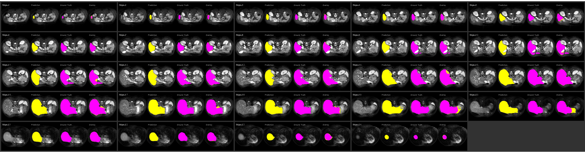

##  实验log对比分析

模型推理测试的关键指标（dice）记录在.csv表格日志文件中，具体结果如下：

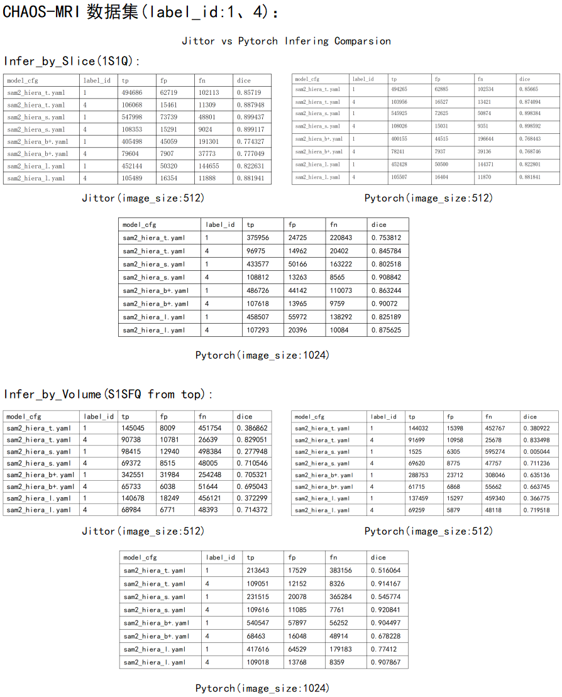

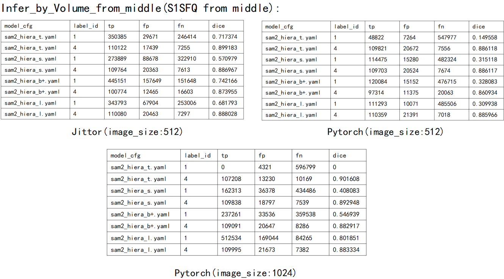

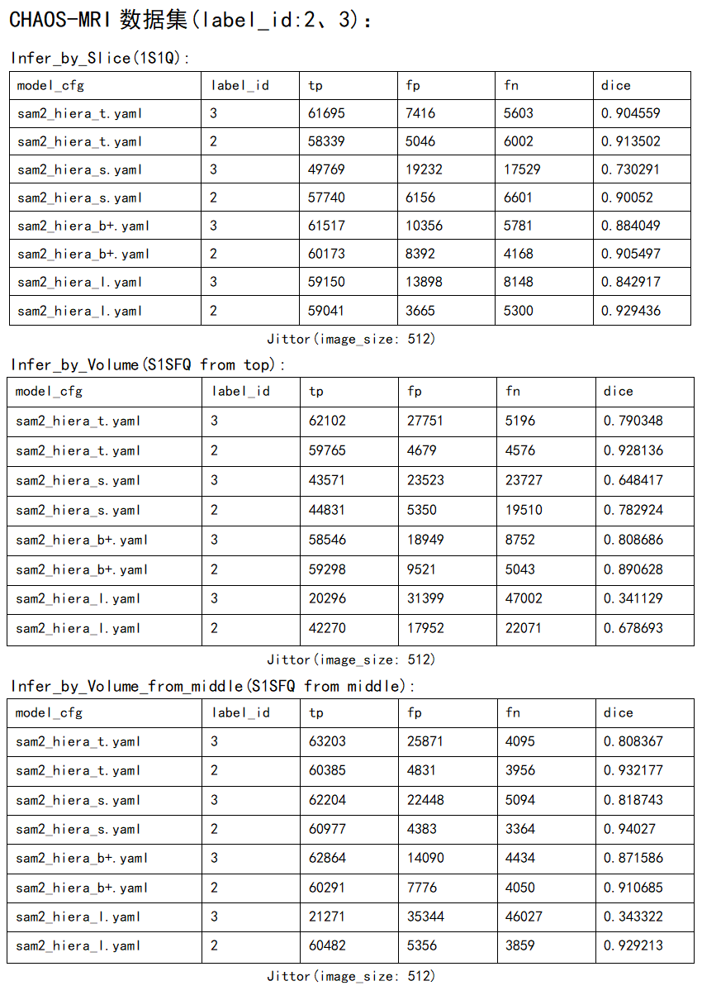

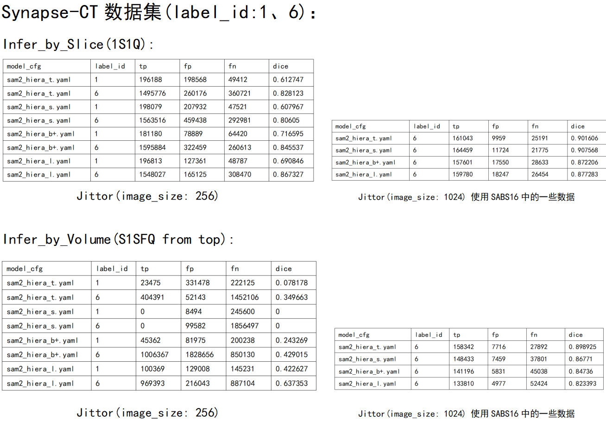

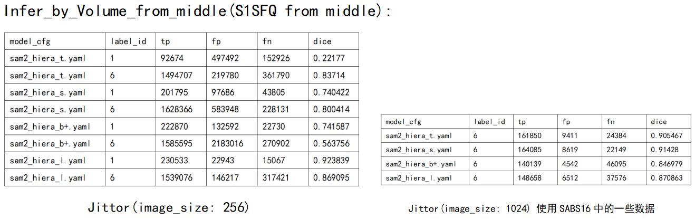

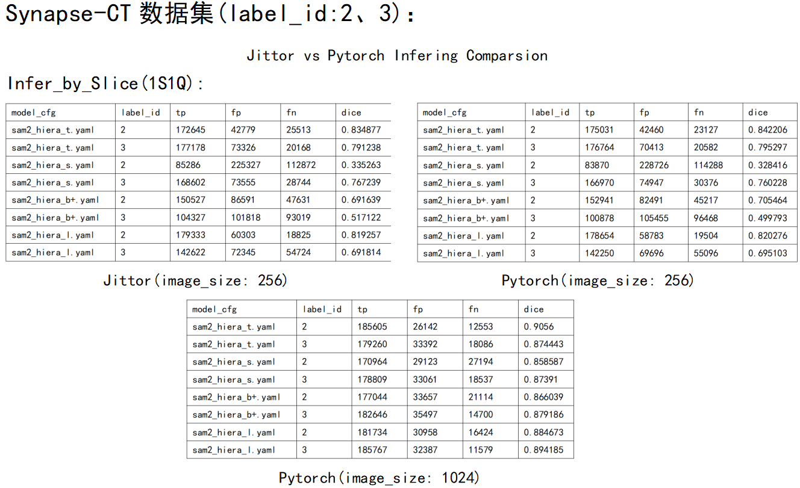

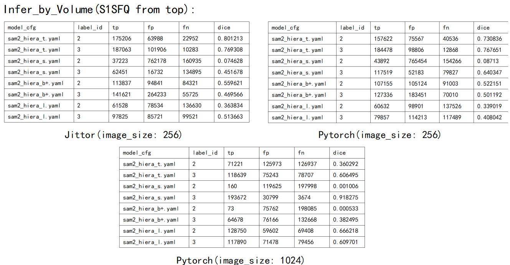

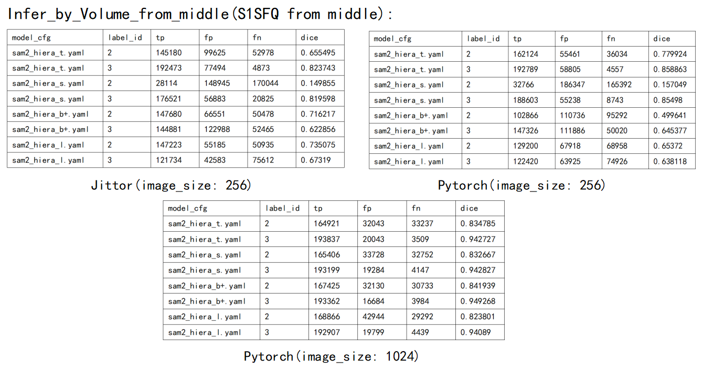

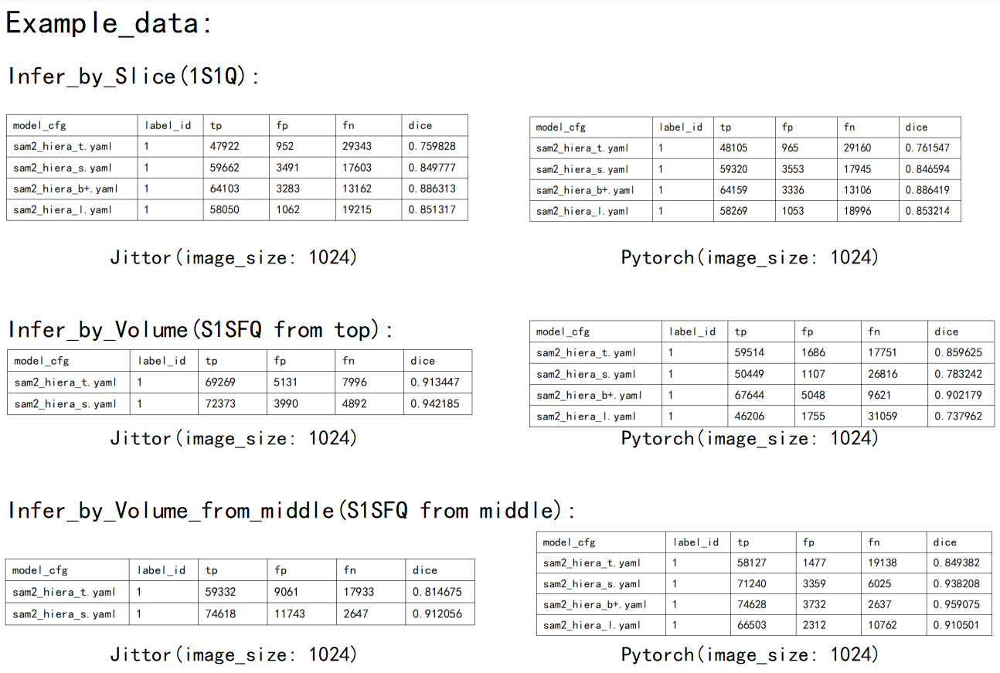

根据如上的推理测试结果，可以看出当image_size由原本的1024减小后，其dice在jittor和pytorch框架下均会显著下降，但也能看出两个框架下的推理结果基本一致，且1S1Q采样方法变得优于S1SFQ from top。而根据example_data数据（尽管选取的数据量少）上的推理测试结果来看，基本验证了论文的结论。

## 性能log

以sam2_hiera_t为例，比较jittor和pytorch框架下在CHAOS-MRI14数据集下以infer_by_volume的推理性能(均是在image_size为512的情况下进行比较)，其log如下：

### Jittor

```
Loading model: sam2_hiera_t.yaml...
Model loaded in 0.39 seconds

Processing case 1_1...
Propagating segmentation for 24 slices...
Case processed in 2.64s | Avg time/slice: 6.2ms | Speed: 161.7 fps
Volume montage saved to: /root/autodl-tmp/JtToFSMedSAM2/SAM2/notebooks/visualization_results/sam2_hiera_t/case_1_1/volume_montage_1_1.png

Processing case 2_1...
Propagating segmentation for 22 slices...
Case processed in 0.96s | Avg time/slice: 1.8ms | Speed: 561.6 fps
Volume montage saved to: /root/autodl-tmp/JtToFSMedSAM2/SAM2/notebooks/visualization_results/sam2_hiera_t/case_2_1/volume_montage_2_1.png

Processing case 5_1...
Propagating segmentation for 28 slices...
Case processed in 1.20s | Avg time/slice: 1.7ms | Speed: 582.1 fps
Volume montage saved to: /root/autodl-tmp/JtToFSMedSAM2/SAM2/notebooks/visualization_results/sam2_hiera_t/case_5_1/volume_montage_5_1.png

Processing case 3_1...
Propagating segmentation for 19 slices...
Case processed in 0.83s | Avg time/slice: 1.7ms | Speed: 598.1 fps
Volume montage saved to: /root/autodl-tmp/JtToFSMedSAM2/SAM2/notebooks/visualization_results/sam2_hiera_t/case_3_1/volume_montage_3_1.png

Processing case 5_2...
Propagating segmentation for 11 slices...
Case processed in 0.48s | Avg time/slice: 1.7ms | Speed: 589.2 fps
Volume montage saved to: /root/autodl-tmp/JtToFSMedSAM2/SAM2/notebooks/visualization_results/sam2_hiera_t/case_5_2/volume_montage_5_2.png

Processing case 1_2...
Propagating segmentation for 14 slices...
Case processed in 0.60s | Avg time/slice: 1.7ms | Speed: 573.3 fps
Volume montage saved to: /root/autodl-tmp/JtToFSMedSAM2/SAM2/notebooks/visualization_results/sam2_hiera_t/case_1_2/volume_montage_1_2.png

Processing case 2_2...
Propagating segmentation for 11 slices...
Case processed in 0.47s | Avg time/slice: 1.7ms | Speed: 594.7 fps
Volume montage saved to: /root/autodl-tmp/JtToFSMedSAM2/SAM2/notebooks/visualization_results/sam2_hiera_t/case_2_2/volume_montage_2_2.png

Processing case 3_2...
Propagating segmentation for 14 slices...
Case processed in 0.59s | Avg time/slice: 1.7ms | Speed: 593.7 fps
Volume montage saved to: /root/autodl-tmp/JtToFSMedSAM2/SAM2/notebooks/visualization_results/sam2_hiera_t/case_3_2/volume_montage_3_2.png
sam2_hiera_t.yaml
label: 1, dice: 0.38685973690667974
sam2_hiera_t.yaml
label: 4, dice: 0.829033864314331

Model sam2_hiera_t.yaml Summary:
  Total slices processed: 143
  Total propagation time: 0.35s
  Average time per slice: 2.5ms
  Average speed: 405.5 fps
```

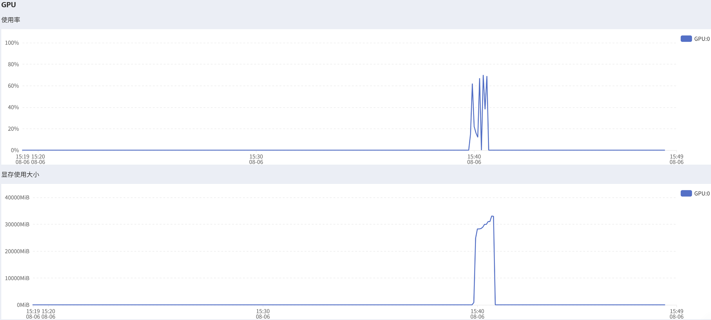

### Pytorch

```
Loading model: sam2_hiera_t.yaml...
Model loaded in 0.86 seconds

Processing case 1_1...
Propagating segmentation for 24 slices...
Case processed in 0.81s | Avg time/slice: 0.1ms | Speed: 8330.3 fps
Volume montage saved to: /root/autodl-tmp/JtToFSMedSAM2/sam2_pytorch/notebooks/visualization_results/sam2_hiera_t/case_1_1/volume_montage_1_1.png

Processing case 2_1...
Propagating segmentation for 22 slices...
Case processed in 0.39s | Avg time/slice: 0.1ms | Speed: 12213.7 fps
Volume montage saved to: /root/autodl-tmp/JtToFSMedSAM2/sam2_pytorch/notebooks/visualization_results/sam2_hiera_t/case_2_1/volume_montage_2_1.png

Processing case 5_1...
Propagating segmentation for 28 slices...
Case processed in 0.48s | Avg time/slice: 0.1ms | Speed: 12390.9 fps
Volume montage saved to: /root/autodl-tmp/JtToFSMedSAM2/sam2_pytorch/notebooks/visualization_results/sam2_hiera_t/case_5_1/volume_montage_5_1.png

Processing case 3_1...
Propagating segmentation for 19 slices...
Case processed in 0.33s | Avg time/slice: 0.1ms | Speed: 12338.1 fps
Volume montage saved to: /root/autodl-tmp/JtToFSMedSAM2/sam2_pytorch/notebooks/visualization_results/sam2_hiera_t/case_3_1/volume_montage_3_1.png

Processing case 5_2...
Propagating segmentation for 11 slices...
Case processed in 0.20s | Avg time/slice: 0.1ms | Speed: 12395.8 fps
Volume montage saved to: /root/autodl-tmp/JtToFSMedSAM2/sam2_pytorch/notebooks/visualization_results/sam2_hiera_t/case_5_2/volume_montage_5_2.png

Processing case 1_2...
Propagating segmentation for 14 slices...
Case processed in 0.25s | Avg time/slice: 0.1ms | Speed: 12264.0 fps
Volume montage saved to: /root/autodl-tmp/JtToFSMedSAM2/sam2_pytorch/notebooks/visualization_results/sam2_hiera_t/case_1_2/volume_montage_1_2.png

Processing case 2_2...
Propagating segmentation for 11 slices...
Case processed in 0.20s | Avg time/slice: 0.1ms | Speed: 11636.2 fps
Volume montage saved to: /root/autodl-tmp/JtToFSMedSAM2/sam2_pytorch/notebooks/visualization_results/sam2_hiera_t/case_2_2/volume_montage_2_2.png

Processing case 3_2...
Propagating segmentation for 14 slices...
Case processed in 0.25s | Avg time/slice: 0.1ms | Speed: 11561.4 fps
Volume montage saved to: /root/autodl-tmp/JtToFSMedSAM2/sam2_pytorch/notebooks/visualization_results/sam2_hiera_t/case_3_2/volume_montage_3_2.png
sam2_hiera_t.yaml
label: 1, dice: 0.38092165203926326
sam2_hiera_t.yaml
label: 4, dice: 0.8334984593290128

Model sam2_hiera_t.yaml Summary:
  Total slices processed: 143
  Total propagation time: 0.01s
  Average time per slice: 0.1ms
  Average speed: 11289.0 fps
```

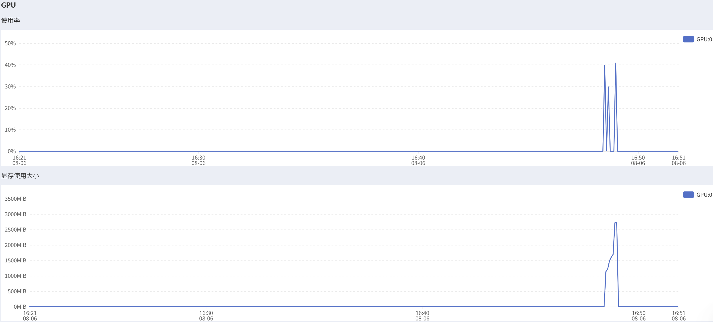

从上面的性能log可以看出，pytorch的运行速度明显比jittor快（主要是因为复现jittor框架时，未充分发挥jittor并行能力，即每次输入仅传入一个.npz数据），且gpu显存使用率和使用大小均远小于jittor的gpu使用率和使用大小，这可能是因为我在复现sam2中的RoPEAttention时，将pytorch使用的复数张量转为了常规的实数张量来进行实现（这也导致了我后面实现时出现了一些维度不匹配问题，为了解决这个问题，我是直接转为原来匹配的4维张量，这有可能就是jittor框架使用gpu显存过多，当然也不排除jittor框架的本身问题。不过，好像jittor也支持复数张量，当时复现时没在jittor文档中搜索到）。

## 总结

基本复现了Jittor版本的FS-MedSAM2论文，与PyTorch版本在同等image_size的情况下实验指标和性能指标上基本一致。此外，我们还可以注意到其推理的结果在某些label_id数据上依旧表现极差，对于这个原因我至今未排查出。不过，在复现过程中，发现其论文所给代码有一处bug：

```python
maskmem_features, maskmem_pos_enc = self._encode_new_memory(
  current_vision_feats=current_vision_feats,
  feat_sizes=feat_sizes,
  pred_masks_high_res=high_res_masks,
  is_mask_from_pts=is_mask_from_pts,
  )
```

此处调用_encode_new_memory函数时，漏了一个参数object_score_logits。所以我怀疑一些label_id数据的推理结果极差的原因是因为这个。

## 联系方式

<u>yrc325yrc@163.com</u>
